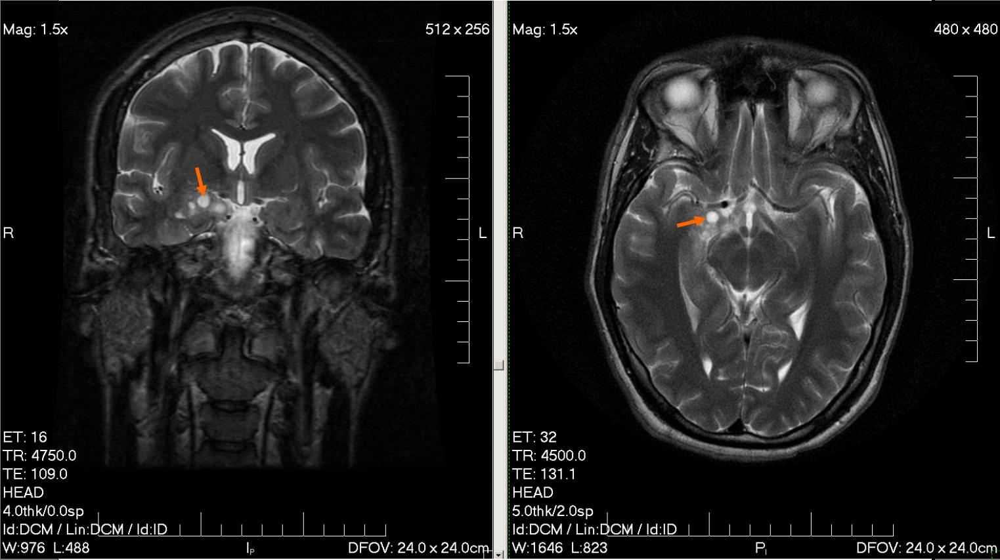
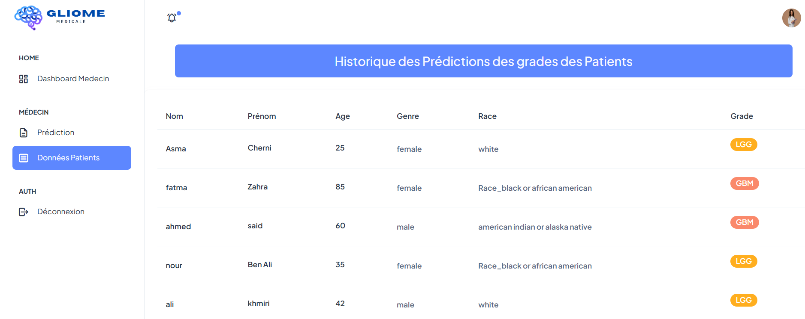
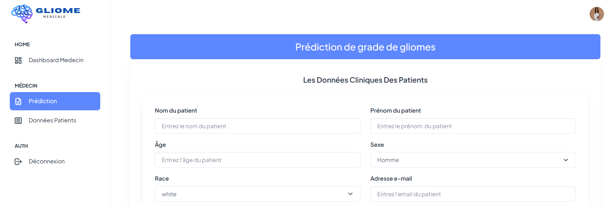
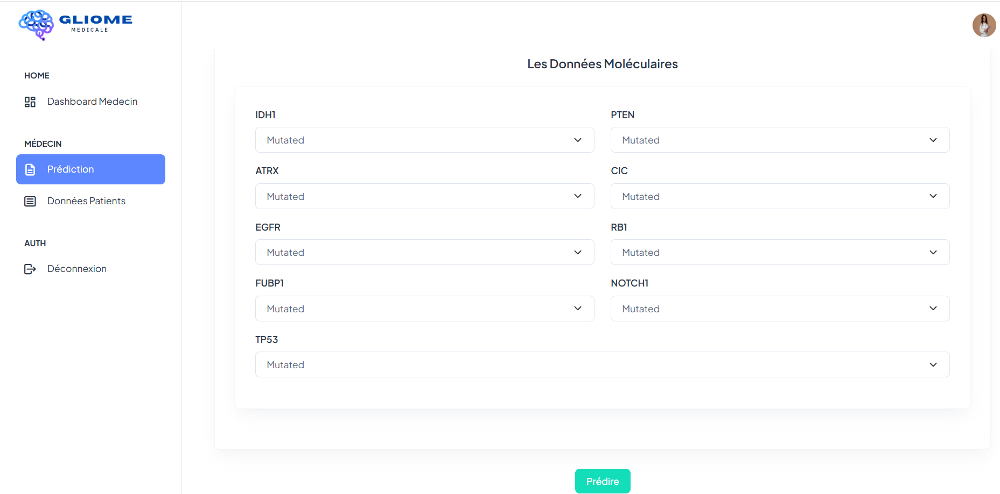
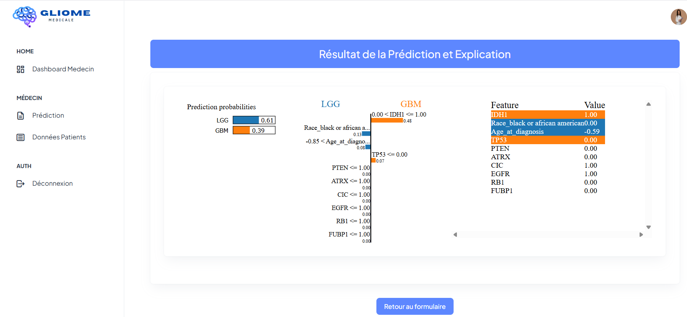

# 🧠 Glioma Grade Prediction Application


## 📝 Description

Cette application web basée sur Flask permet de **prédire le grade des gliomes** (tumeurs cérébrales) en utilisant des techniques de machine learning avancées. Le projet intègre **XAI (eXplainable AI)** pour fournir des explications détaillées et interprétables des prédictions, aidant ainsi les professionnels de santé à comprendre les facteurs influençant chaque diagnostic.
### Les Gliomes


## 🏗️ Architecture du Projet

```
<PROJECT ROOT>
├── app.py                      # Application Flask principale
├── Logistic.pkl                # Modèle de régression logistique entraîné
├── scaler.pkl                  # Normalisateur des données
├── explainer.pkl               # Explainer XAI (SHAP/LIME)
├── requirements.txt            # Dépendances Python
├── README.md                   # Documentation
│
├── __pycache__/                # Cache Python
├── venv/                       # Environnement virtuel
│
├── static/                     # Fichiers statiques
│   ├── css/                    # Styles CSS
│   ├── js/                     # Scripts JavaScript
│   └── images/                 # Images et logos
│
└── templates/                      # Templates HTML
    ├── index.html                  # Page d'accueil
    ├── accueil.html                # Page d'accueil alternative
    ├── authentication-login.html   # Page de connexion
    ├── authentication-register.html # Page d'inscription
    ├── admin_dashboard.html        # Tableau de bord administrateur
    ├── medecin_dashboard.html      # Tableau de bord médecin
    ├── userProfile.html            # Profil utilisateur
    ├── gerer-medecin.html          # Gestion des médecins
    ├── modifier_medecin.html       # Modification des médecins
    └── prédiction.html             # Page de prédiction
```

## 🔬 Technologies Utilisées

### Backend & Machine Learning
- **Python 3.8+** - Langage principal
- **Flask** - Framework web léger
- **Scikit-learn** - Modèles de machine learning
- **XGBoost / Logistic Regression** **/...** - Algorithmes de classification
- **Pandas & NumPy** **/...** - Manipulation de données

### Explicabilité (XAI)
- **LIME** (Local Interpretable Model-agnostic Explanations) - Explications locales
- **Matplotlib / Plotly** - Visualisations interactives

### Frontend
- **HTML5 / CSS3** - Structure et style
- **JavaScript** - Interactivité
- **Bootstrap**  - Design responsive

## 📊 Modèle de Machine Learning

### Entraînement
Le modèle a été entraîné sur un dataset médical validé contenant :
- Caractéristiques cliniques
- Marqueurs biologiques
- Historique patient

## 🔍 Explicabilité (XAI)

### Pourquoi XAI ?
Dans le domaine médical, il est crucial de comprendre **pourquoi** un modèle fait une prédiction. XAI permet :
- **Confiance** : Les médecins peuvent valider les décisions
- **Transparence** : Identification des biais potentiels
- **Apprentissage** : Découverte de nouvelles corrélations cliniques
- **Conformité** : Respect des réglementations médicales

### Techniques utilisées
#### LIME (Local Interpretable Model-agnostic Explanations)
- Explique les prédictions individuelles
- Crée un modèle local interprétable autour de chaque prédiction
- Visualisations intuitives pour les non-experts

## 🎨 Captures d'écran

### Historique de Prédiction


### Formulaire de prédiction



### Résultats avec explications XAI


## 👨‍💻 Auteur

**Maysen Chiha & Nada Cherni**
- GitHub: [@maysenchiha](https://github.com/maysenchiha)
- LinkedIn: [[Votre profil LinkedIn](https://www.linkedin.com/in/maysen-chiha/)]
- Email: maysen.chiha@gmail.com

## 📚 Références

- [SHAP Documentation](https://shap.readthedocs.io/)
- [LIME Documentation](https://lime-ml.readthedocs.io/)
- [Flask Documentation](https://flask.palletsprojects.com/)
- [Scikit-learn Guide](https://scikit-learn.org/)

## 🙏 Remerciements

- Dataset Open Source.
- Inspiré par les travaux de recherche en neuro-oncologie
- Communauté open-source pour les outils XAI

---

⚠️ **Disclaimer** : Cette application est développée à des fins de recherche et d'éducation dans le cadre d'un PFA. Elle ne doit pas être utilisée comme substitut à un diagnostic médical professionnel. Consultez toujours un professionnel de santé qualifié pour toute question médicale.

**© 2024 - Glioma Grade Prediction Project**
